# react-admin
reacthooks+typescript+redux+json-server完成的中台系统demo
实现功能包括:用户权限的管理、用户管理、编写活动和草稿功能、还有发布管理

需要安装json-server

输入:   `json-server --watch --port 53000 db.json`

**项目启动**
`yarn`
`yarn dev`

**项目预览**

home页面:

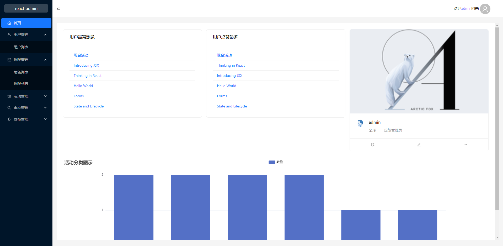

用户列表
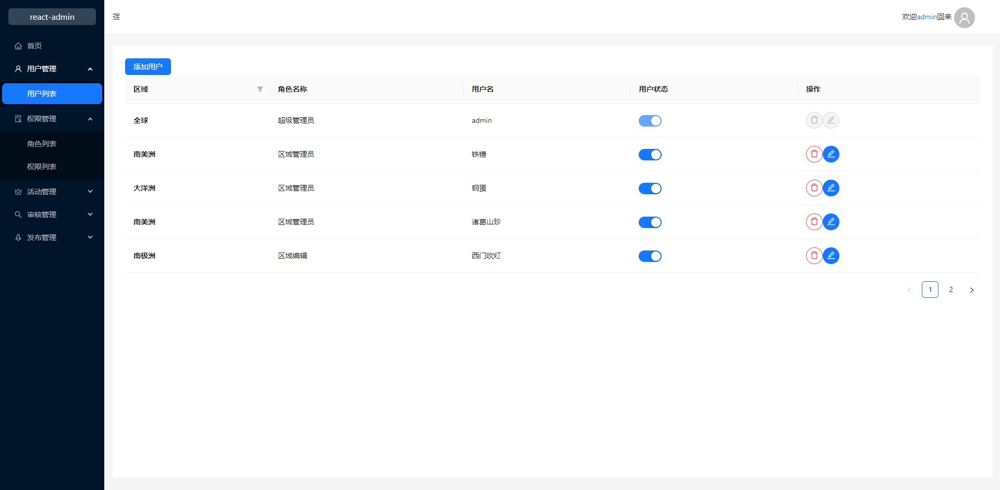

角色列表
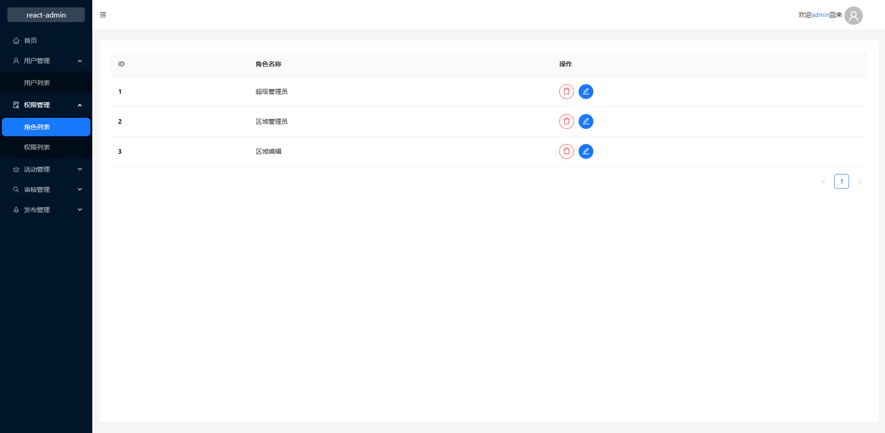

权限列表
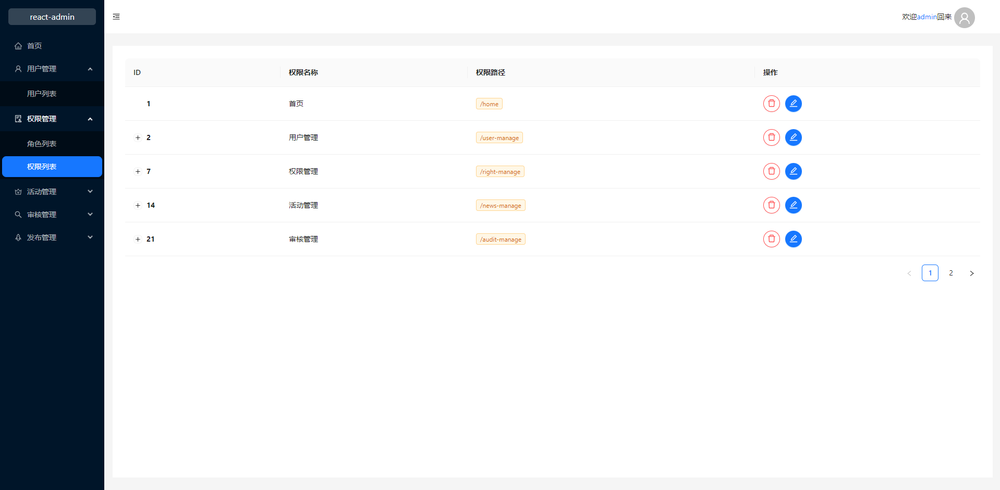

编写活动
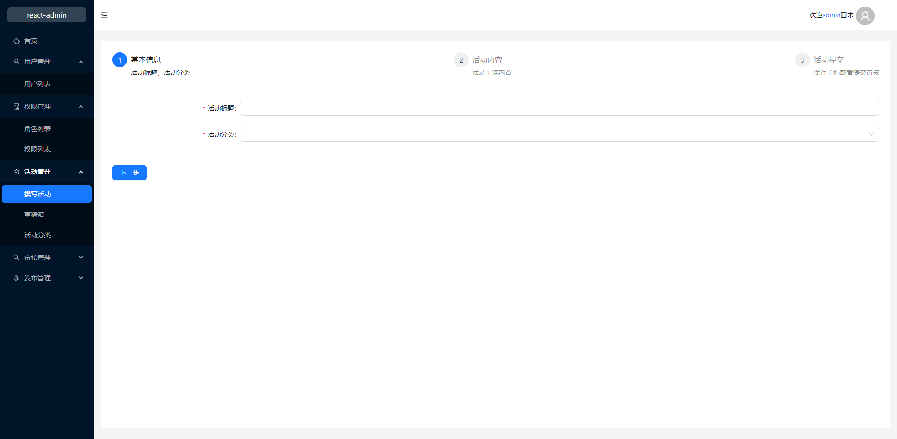

草稿箱
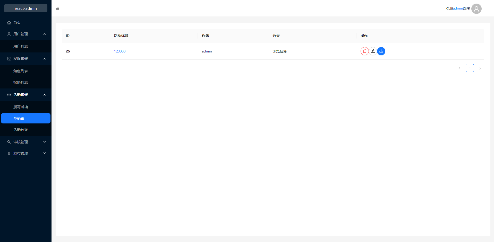

活动分类
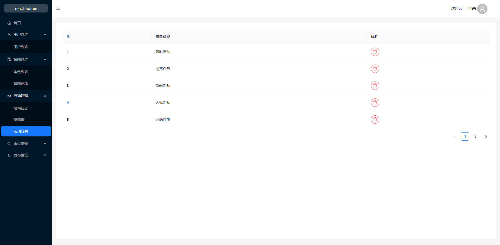

审核活动
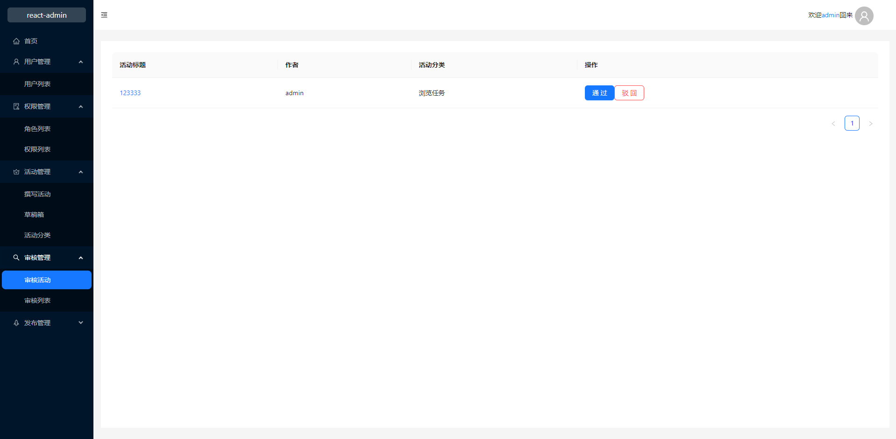

审核列表
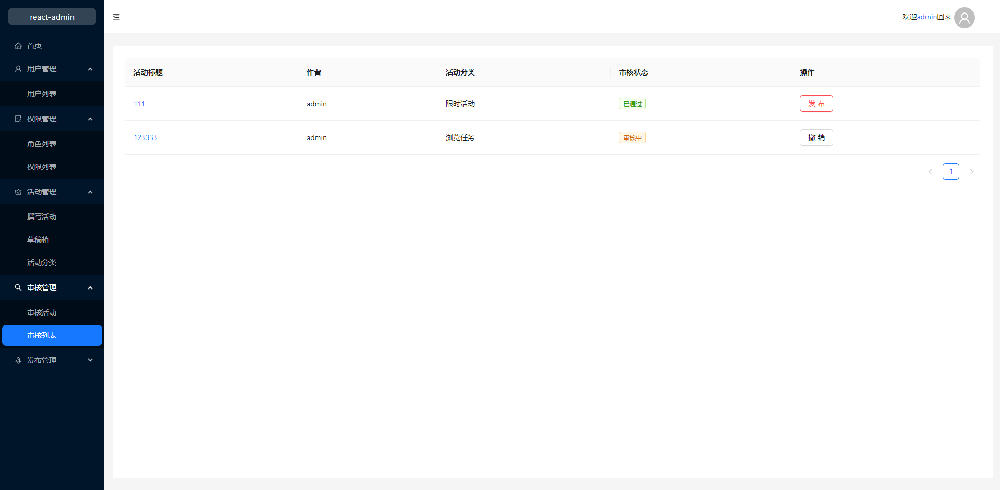

待发布
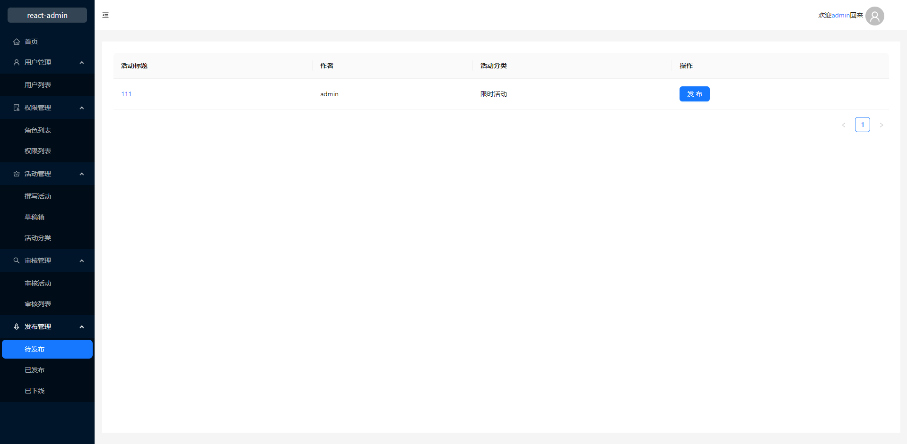;

已发布
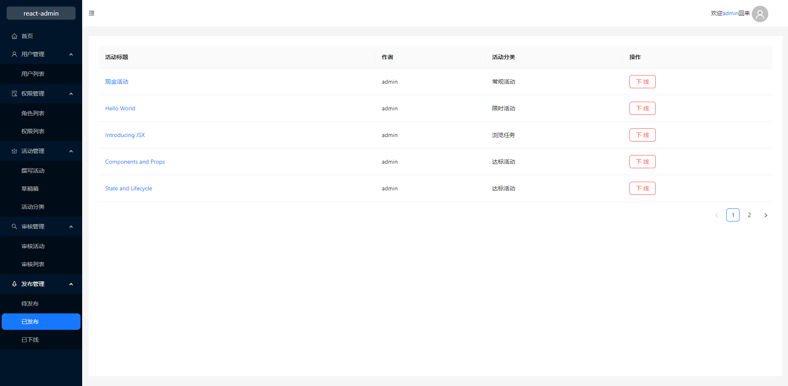

已下线
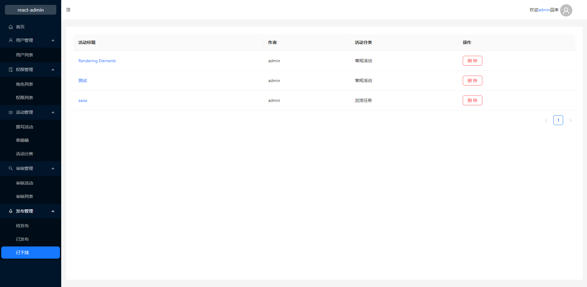